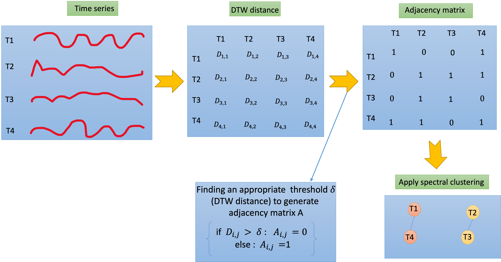

# Graph-based-clutersing-for-TS
This is the repository for our paper titled "[Graph-based clustering for time series data](https://ieeexplore.ieee.org/iel7/9671263/9671273/09671398.pdf)". This paper has been accepted at [2021 IEEE International Conference on Big Data (Big Data)](https://ieeexplore.ieee.org/xpl/conhome/9671263/proceeding)
# Abstract
Clustering is an important data mining task that
consists of grouping data without prior knowledge of classes.
In recent years, with the rise of big data and its various
applications, unsupervised learning such as clustering algorithms
has attracted massive interest in the data mining field. In the
case of time series data, temporal changes are difficult to detect,
which makes the clustering for temporal sequence data more
complex than traditional vector data. In this paper, we propose
a new model that generates graphs from time series data to
preserve important relations between different data points. In
particular, every time series data will be considered as a node,
then edges will be added between nodes if the dynamic time
warping distances of time series data achieve a specific threshold,
then a spectral clustering algorithm is applied to the generated
graph. Our results show that our new proposal time series graph
representation outperforms state-of-the-art clustering algorithms.
# Approach

